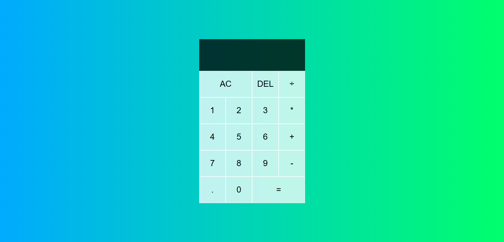
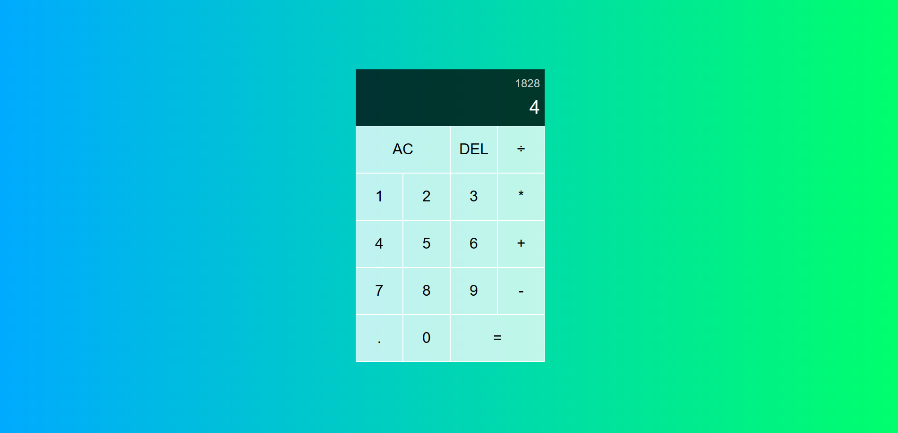

# Simple Calculator

This is a simple calculator demo project that performs arithmetic operations such as addition, subtraction, multiplication, and division on two numbers entered by the user. The user interface of the calculator is designed to be simple and easy to use, with buttons for each of the arithmetic operations, as well as buttons for the digits 0 through 9 and a decimal point.

## 💻 Used technologies and libraries

- Javascript
- HTML
- CSS

## ⚙️ Functionality

- Addition (+): Used to add two or more numbers together.
- Subtraction (-): Used to subtract one number from another.
- Multiplication (x or *): Used to multiply two or more numbers together.
- Division (/ or ÷): Used to divide one number by another.

## 🌐 Live Demo

You can view a live demo of the app here: 
--> <a href="https://Calculator.pavlinbg.repl.co/">Calculator</a> 

## Screenshots

 

## 📬 Feedback
Thank you for viewing my project! 
If you have any questions, comments or you come across some bugs, please contact me through the contact info in my profile. 
Any feedback is highly appreciated! 🙂
